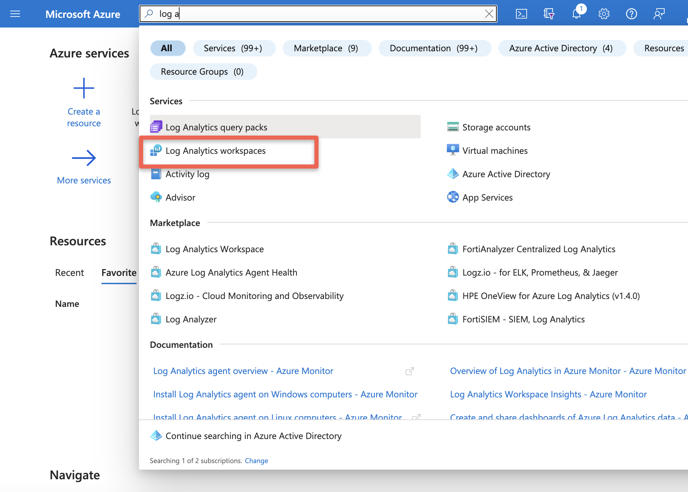

== Introduction

Azure Red Hat OpenShift (ARO) clusters store log data inside the cluster by default. Understanding metrics and logs is critical in successfully running your cluster. Included with ARO is the OpenShift Cluster Logging Operator, which is intended to simplify log management and analysis within an ARO cluster, offering centralized log collection, powerful search capabilities, visualization tools, and integration with other Azure systems like https://azure.microsoft.com/en-us/products/storage/files[Azure Files] or https://azure.microsoft.com/en-us/products/monitor/[Log Analytics from Azure Monitor].

In this section of the workshop, we'll configure ARO, as alternative, to forward logs to Azure Monitor and view them using Log Analytics. To achive this we will use Fluentd. Fluentd is the log collection and forwarding tool used by OpenShift Logging, however it does not have native support for Azure Log Analytics. However Fluent-bit which supports many of the same protocols as Fluentd does have https://docs.fluentbit.io/manual/pipeline/outputs/azure[native support] for Azure Log Analytics.

Armed with this knowledge we can create a fluent-bit service on the cluster to accept logs from fluentd and forward them to Azure Log Analytics.

== Configure Cluster Logging and Log Forwarding to Azure Monitoring

. First, let's set some environment variables:
+
[source,sh,role=execute]
----
NAMESPACE=aro-clf-am
AZR_RESOURCE_LOCATION=$(az aro show --resource-group openenv-${GUID} --name aro-cluster-${GUID} --query location -o tsv)
AZR_RESOURCE_GROUP=openenv-${GUID}

AZR_LOG_APP_NAME=${AZR_RESOURCE_GROUP}-${AZR_RESOURCE_LOCATION}

echo ${AZR_LOG_APP_NAME}
----
+
.Sample Output
[source,text,options=nowrap]
----
openenv-q6xmh-eastus
----

. Next, let's create our Log Analytics Workspace. To do so, run the following command:
+
[source,sh,role=execute]
----
az extension add --name log-analytics

az group create -n ${AZR_RESOURCE_GROUP} -l ${AZR_RESOURCE_LOCATION}

az monitor log-analytics workspace create \
 -g ${AZR_RESOURCE_GROUP} -n ${AZR_LOG_APP_NAME} \
 -l ${AZR_RESOURCE_LOCATION}
----
+
.Sample Output
[source,text,options=nowrap]
----
{
  ....
  "location": "eastus",
  "modifiedDate": "2023-11-08T10:17:28.293145Z",
  "name": "openenv-q6xmh-eastus",
  "provisioningState": "Succeeded",
  "publicNetworkAccessForIngestion": "Enabled",
  "publicNetworkAccessForQuery": "Enabled",
  "resourceGroup": "openenv-q6xmh",
  "retentionInDays": 30,
[... Lots of output Omitted ...]
----

. Now, let's grab our workspace id and the shared key. To do so, run the following command:
+
[source,sh,role=execute]
----
WORKSPACE_ID=$(az monitor log-analytics workspace show \
  -g ${AZR_RESOURCE_GROUP} -n ${AZR_LOG_APP_NAME} \
  --query customerId -o tsv)
SHARED_KEY=$(az monitor log-analytics workspace get-shared-keys \
  -g ${AZR_RESOURCE_GROUP} -n ${AZR_LOG_APP_NAME} \
  --query primarySharedKey -o tsv)

echo WORKSPACE_ID: ${WORKSPACE_ID}
echo SHARED_KEY: ${SHARED_KEY}
----
+
.Sample Output
[source,text,options=nowrap]
----
WORKSPACE_ID: 3af6648e-c5ea-95b4-478f-48fa1e54af66
SHARED_KEY: K5W9z2ELjEqKNuIjmmZ/mOWe9KP2GasdEkmqfasdf2XP/IFiFmyVTIDiataQQBq59vW0/Ko9IEoMT2fSIg==
----

. Before deploying new OpenShift Logging and Log Forwarding instances, ensure that any previous instances are deleted if they exist:
+
[source,sh,role=execute]
----
oc delete clusterlogforwarder -n openshift-logging instance
oc delete clusterlogging -n openshift-logging instance 
----
+
.Sample Output
[source,text,options=nowrap]
----
clusterlogforwarder.logging.openshift.io "instance" deleted
clusterlogging.logging.openshift.io "instance" deleted
----

. Download and set up the `helm` template manager if it hasn't been installed before.:
+
[source,sh,role=execute]
----
cd $HOME

wget https://mirror.openshift.com/pub/openshift-v4/clients/helm/latest/helm-linux-amd64.tar.gz -O ~/helm.tar.gz

tar -xvf ~/helm.tar.gz

mkdir ~/bin

mv ~/helm-linux-amd64 ~/bin/helm

rm ~/helm.tar.gz
----

. Check that `helm` is installed properly:
+
[source,sh,role=execute]
----
helm version
----
+
.Sample Output
[source,text,options=nowrap]
----
version.BuildInfo{Version:"v3.11.1+6.el8", GitCommit:"66bfc44f827aea6eb8e001150914170ac0d49e2d", GitTreeState:"clean", GoVersion:"go1.18.9"}
----

. Next, let's add the MOBB Helm Chart repository. To do so, run the following command:
+
[source,sh,role=execute]
----
helm repo add mobb https://rh-mobb.github.io/helm-charts/

helm repo update
----
+
.Sample Output
[source,text,options=nowrap]
----
"mobb" has been added to your repositories
Hang tight while we grab the latest from your chart repositories...
...Successfully got an update from the "mobb" chart repository
Update Complete. ⎈Happy Helming!⎈
----

. Now, we need to create a project (namespace) to deploy our fluent-bit service to. To create that, run the following command:
+
[source,sh,role=execute]
----
oc new-project ${NAMESPACE}
----
+
.Sample Output
[source,text,options=nowrap]
----
Now using project "aro-clf-am" on server "https://api.rbrlitrg.westeurope.aroapp.io:6443".

You can add applications to this project with the 'new-app' command. For example, try:

    oc new-app rails-postgresql-example

to build a new example application in Ruby. Or use kubectl to deploy a simple Kubernetes application:

    kubectl create deployment hello-node --image=k8s.gcr.io/e2e-test-images/agnhost:2.33 -- /agnhost serve-hostname
----

.  Next, let's deploy the Grafana, Cluster Logging, and Loki operators from the file we just created above. To do so, run the following command:
+
[source,sh,role=execute]
----
helm upgrade -n ${NAMESPACE} clf \
   mobb/aro-clf-am --install \
   --set "azure.workspaceId=${WORKSPACE_ID}" --set "azure.sharedKey=${SHARED_KEY}"
----
+
.Sample Output
[source,text,options=nowrap]
----
Release "clf" does not exist. Installing it now.
NAME: clf
LAST DEPLOYED: Wed Nov  8 11:08:56 2023
NAMESPACE: aro-clf-am
STATUS: deployed
REVISION: 1
TEST SUITE: None
----

. Wait until fluent-bit daemonset has successfully deployed. Run the following command:
+
[source,sh,role=execute]
----
oc -n ${NAMESPACE} rollout status daemonset clf-aro-clf-am
----

== View Logs in Azure Monitor

Now that the log are forwarding to Azure Monitor throught our fluent-bit deployment, let's view them.

There are two options: via command-line, or in the Azure Portal

=== Via command-line

To get the logs, run the following command:

[source,sh,role=execute]
----
az monitor log-analytics query -w ${WORKSPACE_ID}  \
   --analytics-query "openshift_CL | sort by TimeGenerated | take 10 | project TimeGenerated, kubernetes_namespace_name_s, kubernetes_pod_name_s, kubernetes_container_name_s, Message" \
   --output tsv
----

.Sample Output
[source,text,options=nowrap]
----
{"level":"warn","ts":"2023-11-08T11:30:01.845Z","caller":"fileutil/purge.go:72","msg":"failed to lock file","path":"/var/lib/etcd/member/wal/000000000000009a-0000000000123a41.wal","error":"fileutil: file already locked"}    PrimaryResult   2023-11-08T11:30:07.7850492Z    etcd    openshift-etcd etcd-aro-cluster-q6xmh-dkvlm-master-2
time="2023-11-08T11:30:00.916493542Z" level=info msg=response go.version=go1.18.7 http.request.host="10.128.2.16:5000" http.request.id=64bee98d-1e48-47b4-abed-21531e6eee10 http.request.method=GET http.request.remoteaddr="10.128.2.2:43028" http.request.uri=/healthz http.request.useragent=kube-probe/1.24 http.response.duration="31.8µs" http.response.status=200 http.response.written=0        PrimaryResult   2023-11-08T11:30:07.1961794Z   registry openshift-image-registry        image-registry-8584f8b8f7-lrfds
time="2023-11-08T11:30:00.915971836Z" level=info msg=response go.version=go1.18.7 http.request.host="10.128.2.16:5000" http.request.id=3ac3ba01-c9ed-42c1-8f5a-6fdeb2827f5e http.request.method=GET http.request.remoteaddr="10.128.2.2:43024" http.request.uri=/healthz http.request.useragent=kube-probe/1.24 http.response.duration="42.6µs" http.response.status=200 http.response.written=0        PrimaryResult   2023-11-08T11:30:07.1961794Z   registry openshift-image-registry        image-registry-8584f8b8f7-lrfds
2023/11/08 11:30:01 oauthproxy.go:857: authenticated "admin" via basic auth     PrimaryResult   2023-11-08T11:30:06.4792147Z    grafana-proxy   custom-logging  grafana-deployment-bc6fd6856-9mfgb
2023/11/08 11:30:00 oauthproxy.go:857: authenticated "admin" via basic auth     PrimaryResult   2023-11-08T11:30:06.4792147Z    grafana-proxy   custom-logging  grafana-deployment-bc6fd6856-9mfgb

[... Lots of output Omitted ...]
----

=== Via Azure Portal

. Log into Azure https://portal.azure.com/#blade/Microsoft_Azure_Monitoring/AzureMonitoringBrowseBlade/logs[Azure Log Insights] or you can login into portal and search for "Log Analytics workspace"
+

. Now select your Log Analytics workspace created previously, and then click on Logs:
+
image::../../media/loganalytics-logs.png[]

. Write the query and click on "Run" button:
+
[source,sh,options=nowrap]
----
openshift_CL
| sort by TimeGenerated
| take 10 
| project TimeGenerated, kubernetes_namespace_name_s, kubernetes_pod_name_s, kubernetes_container_name_s, Message
----
+
When you run it, you'll be able to see the results and analyze the logs. Play with the fields and refine your query to analyze the logs and troubleshoot effectively.
+

*Congratulations!*

Your cluster is now sending logs to a Log Analytics Workspace in Azure Monitor.

== Summary

Here you learned how to:

* Configure log forwarding to Azure Monitor
* View logs in a Log Analytics Workspace via Azure Portal
